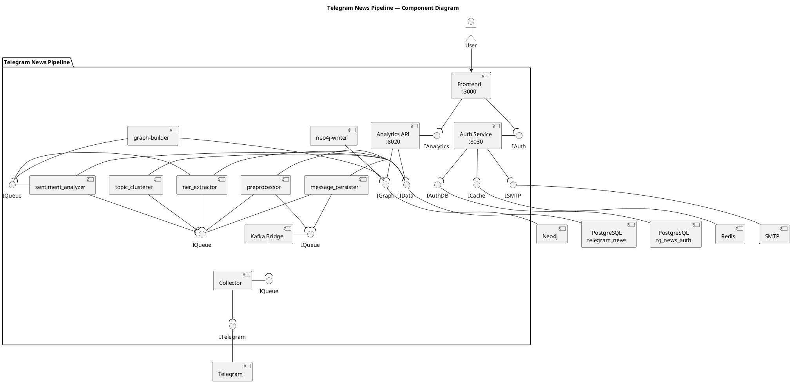
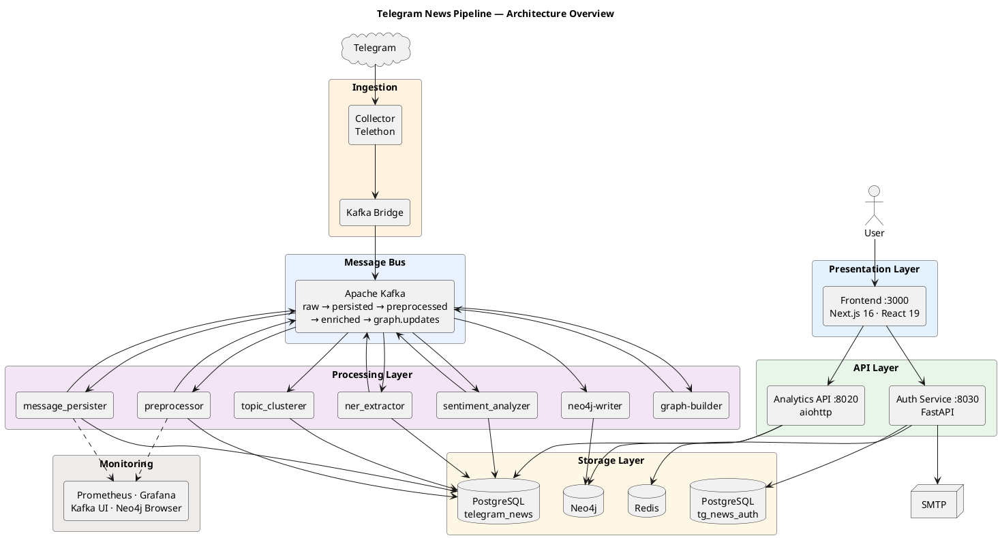

# Архитектура системы Telegram News Pipeline

## Общее описание

Telegram News Pipeline — event-driven система для сбора, обработки и анализа новостей из публичных Telegram-каналов. Построена по принципу микросервисов, связанных через Apache Kafka.

---

## Диаграмма

Полная PlantUML-диаграмма: [`architecture_full.puml`](./architecture_full.puml)



---

## Диаграмма архитектуры



---

## Стек технологий

### Frontend

| Технология | Версия | Назначение |
|-----------|--------|-----------|
| Next.js | 16.1.6 | App Router, SSR, маршрутизация |
| React | 19 | UI-библиотека |
| TypeScript | 5.x | Типизация |
| Tailwind CSS | v4 | Утилитарные стили |
| TanStack Query | 5.x | Серверное состояние, кэширование, polling |
| Recharts | 2.x | Графики: sentiment, volume, channel bar |
| Cytoscape.js | 3.x | Визуализация графа связей |
| Framer Motion | 12.x | Анимации и page transitions |
| jose | 6.x | JWT-декодирование на клиенте |
| next-themes | 0.4.x | Темизация (light / dark / system) |

### Backend — Auth Service

| Технология | Версия | Назначение |
|-----------|--------|-----------|
| Python | 3.11+ | Язык |
| FastAPI | 0.115+ | HTTP-фреймворк |
| SQLAlchemy | 2.x (async) | ORM |
| asyncpg | 0.30+ | Асинхронный драйвер PostgreSQL |
| python-jose | 3.x | JWT (генерация и валидация) |
| passlib + bcrypt | — | Хэширование паролей |
| slowapi | 0.1.x | Rate limiting |
| aiosmtplib | 3.x | Отправка email |
| Alembic | 1.x | Миграции БД |

### Backend — Analytics API

| Технология | Версия | Назначение |
|-----------|--------|-----------|
| Python | 3.11+ | Язык |
| aiohttp | 3.x | HTTP-фреймворк |
| Pydantic | 2.x | Валидация и сериализация |

### Backend — Kafka Processors

| Технология | Версия | Назначение |
|-----------|--------|-----------|
| Python | 3.11+ | Язык |
| aiokafka | 0.11+ | Асинхронный Kafka consumer/producer |
| asyncpg | 0.30+ | Асинхронный драйвер PostgreSQL |
| Pydantic | 2.x | Схемы событий |
| jsonschema | 4.x | Валидация JSON Schema |

### ML / NLP

| Технология | Назначение |
|-----------|-----------|
| transformers + DeepPavlov RuBERT | Анализ тональности (sentiment_analyzer) |
| Natasha | Извлечение именованных сущностей (ner_extractor) |
| sentence-transformers (SBERT) | Эмбеддинги текстов (topic_clusterer) |
| UMAP | Снижение размерности эмбеддингов |
| HDBSCAN | Кластеризация тем |

### Сбор данных

| Технология | Назначение |
|-----------|-----------|
| Telethon (MTProto) | Подключение к Telegram API, сбор сообщений |
| Pandas | Обработка и экспорт в JSONL/CSV |

### Инфраструктура и хранение

| Технология | Версия | Назначение |
|-----------|--------|-----------|
| PostgreSQL | 15 | Основное хранилище (аналитика + auth) |
| Neo4j | 5.15 | Граф знаний (сущности, связи) |
| Apache Kafka | 7.5 (Confluent) | Шина событий |
| Zookeeper | 7.5 (Confluent) | Координатор Kafka |
| Redis | 7 | Кэш, чёрный список токенов |
| Docker / Docker Compose | — | Контейнеризация |

### Мониторинг

| Технология | Назначение |
|-----------|-----------|
| Prometheus | Сбор метрик (/metrics) |
| Grafana | Визуализация метрик |
| Kafka UI | Веб-интерфейс для Kafka |
| Neo4j Browser | Веб-интерфейс для графа |

---

## Слои системы

| Слой | Технологии | Порт |
|------|-----------|------|
| Frontend | Next.js 16, React 19, TypeScript, Tailwind CSS v4, TanStack Query, Cytoscape.js, Recharts | 3000 |
| Auth Service | FastAPI, SQLAlchemy (async), asyncpg, python-jose (JWT), bcrypt, slowapi | 8030 |
| Analytics API | aiohttp, Pydantic | 8020 |
| Event Bus | Apache Kafka 7.5, Zookeeper | 9092 |
| Processors | Python 3.11+, aiokafka, asyncpg | 8000–8031 |
| Storage | PostgreSQL 15, Neo4j 5.15, Redis 7 | 5432, 7687, 6379 |
| Monitoring | Prometheus, Grafana, Kafka UI, Neo4j Browser | 9090, 3001, 8080, 7474 |

---

## Поток данных

```
Telegram channels
    │  MTProto
    ▼
rbc_telegram_collector  →  JSONL files
    │  bridge script
    ▼
Kafka: raw.telegram.messages
    │
    ├──► message_persister  →  PG: raw_messages  →  Kafka: persisted.messages
    │
    ├──► preprocessor  →  PG: preprocessed_messages  →  Kafka: preprocessed.messages
    │         │
    │         ├──► sentiment_analyzer (RuBERT)  →  PG: sentiment_results  →  Kafka: sentiment.enriched
    │         │
    │         ├──► ner_extractor (Natasha)  →  PG: ner_results  →  Kafka: ner.enriched
    │         │
    │         └──► topic_clusterer (SBERT+UMAP+HDBSCAN)  →  PG: cluster_runs_pg + cluster_assignments  →  Kafka: topic.assignments
    │
    │    sentiment.enriched + ner.enriched
    │         │
    │         ▼
    │    graph-builder  →  Kafka: graph.updates
    │         │
    │         ▼
    │    neo4j-writer  →  Neo4j (MERGE nodes & relationships)
    │
    ▼
Analytics API  ←  SQL (PostgreSQL) + Cypher (Neo4j)
    │
    ▼
Frontend  ←  REST  →  Auth Service
    │
    ▼
User Browser
```

---

## Сервисы-процессоры (Kafka pipeline)

| # | Сервис | Потребляет (топик) | Публикует (топик) | Хранилище |
|---|--------|-------------------|-------------------|-----------|
| 1 | message_persister | `raw.telegram.messages` | `persisted.messages` | PG: `raw_messages`, `processed_events` |
| 2 | preprocessor | `raw.telegram.messages`, `persisted.messages` | `preprocessed.messages` | PG: `preprocessed_messages` |
| 3 | sentiment_analyzer | `preprocessed.messages` | `sentiment.enriched` | PG: `sentiment_results` |
| 4 | ner_extractor | `preprocessed.messages` | `ner.enriched` | PG: `ner_results` |
| 5 | topic_clusterer | `preprocessed.messages` | `topic.assignments` | PG: `cluster_runs_pg`, `cluster_assignments` |
| 6 | graph-builder | `sentiment.enriched`, `ner.enriched` | `graph.updates` | — |
| 7 | neo4j-writer | `graph.updates` | — | Neo4j |

Каждый процессор экспонирует `/health` и `/metrics` (Prometheus). При ошибке сообщение отправляется в соответствующий DLQ-топик.

---

## Базы данных

### PostgreSQL — `telegram_news` (аналитическая)

| Таблица | Назначение |
|---------|-----------|
| `raw_messages` | Сырые сообщения из Telegram |
| `preprocessed_messages` | Нормализованный и очищенный текст |
| `sentiment_results` | Оценки тональности (RuBERT) |
| `ner_results` | Именованные сущности (Natasha) |
| `entity_relations` | Subject-Predicate-Object тройки |
| `processed_events` | Дедупликация (идемпотентность) |
| `outbox` | Transactional outbox для Kafka |
| `channels` | Метаданные каналов |

Идемпотентность: `event_id = {channel}:{message_id}`, таблица `processed_events`, `UNIQUE`-ограничения на доменных таблицах.

### PostgreSQL — `tg_news_auth` (авторизация, изолирована)

| Таблица | Назначение |
|---------|-----------|
| `users` | email, username, role, password_hash, is_active, email_verified |
| `refresh_sessions` | Хэши refresh-токенов |
| `admin_audit_log` | Журнал действий администратора |
| `message_reactions` | Лайки / дизлайки пользователей |
| `channel_visibility` | Настройки видимости каналов |

### Neo4j 5.15 (граф знаний)

| Ноды | Связи |
|------|-------|
| `Message` | `MENTIONED_IN` |
| `Entity` | `POSTED_IN` |
| `Channel` | `RELATES_TO` |
| `Topic` | `CO_OCCURS_WITH` |

### Redis 7

Кэш и чёрный список токенов (token blacklist для logout).

---

## Frontend

### Маршруты (App Router)

| Маршрут | Назначение |
|---------|-----------|
| `/` | Dashboard: KPI-карты, sentiment-график, топ-сущности, топики |
| `/login` | Вход / регистрация |
| `/forgot-password` | Запрос сброса пароля |
| `/reset-password` | Установка нового пароля |
| `/feed` | Лента сообщений с фильтрами, live-режим, лайки/дизлайки |
| `/topics` | Кластеры тем со спарклайнами |
| `/topics/[clusterId]` | Детали кластера |
| `/entities` | Таблица сущностей с фильтрами |
| `/entities/[entityId]` | Профиль сущности |
| `/graph` | Граф связей (Cytoscape.js) |
| `/settings` | Настройки: API URL, polling, тема, демо/live |
| `/admin/channels` | Управление видимостью каналов (admin) |
| `/admin/audit-log` | Журнал аудита (admin) |

### Провайдеры состояния

| Провайдер | Назначение |
|-----------|-----------|
| `AuthContext` | JWT, login, register, logout, refresh |
| `TimeRangeContext` | Пресеты: 1h, 6h, 24h, 7d, 30d |
| `DemoContext` | Переключение demo / live (fallback на mock-data) |
| `I18nContext` | Локализация ru / en |
| `ThemeProvider` | Тема: light / dark / system |

### Data Layer

| Модуль | Назначение |
|--------|-----------|
| `lib/api.ts` | HTTP-клиент к Analytics API (:8020) |
| `lib/auth.ts` | HTTP-клиент к Auth Service (:8030) |
| `lib/use-data.ts` | React Query хуки: `useOverview`, `useTopics`, `useEntities`, `useSentiment`, `useMessages`, `useGraph` |
| `lib/mock-data.ts` | Демо-данные при недоступности API |

---

## API-эндпоинты

### Auth Service (:8030)

| Группа | Эндпоинты |
|--------|-----------|
| Auth | `POST /api/auth/register`, `login`, `refresh`, `logout` |
| Профиль | `GET /api/auth/me`, `PUT /api/auth/me`, `POST /api/auth/change-password` |
| Email | `POST /api/auth/forgot-password`, `reset-password`, `verify-email`, `resend-verification` |
| Admin | `PATCH /api/admin/messages/{event_id}`, `GET/PUT /api/admin/channels/{name}`, `GET /api/admin/audit-log` |
| Реакции | `POST /api/messages/{event_id}/reaction`, `GET /api/messages/{event_id}/reactions`, `POST /api/messages/batch-reactions` |

### Analytics API (:8020)

| Эндпоинт | Описание |
|----------|----------|
| `GET /healthz` | Health check |
| `GET /analytics/overview/clusters` | Кластеры тем (фильтры: from, to, channel, topic) |
| `GET /analytics/entities/top` | Топ сущностей (фильтры: cluster_id, topic, entity_type) |
| `GET /analytics/sentiment/dynamics` | Динамика тональности (bucket=hour/day) |
| `GET /analytics/clusters/{id}/documents` | Сообщения кластера |
| `GET /analytics/clusters/{id}/related` | Связанные кластеры |

---

## Инфраструктура (Docker Compose)

Главный файл: `docker-compose.infrastructure.yml`

| Сервис | Образ | Порт |
|--------|-------|------|
| postgres | postgres:15-alpine | 5432 |
| neo4j | neo4j:5.15-community | 7474, 7687 |
| zookeeper | confluentinc/cp-zookeeper:7.5.0 | 2181 |
| kafka | confluentinc/cp-kafka:7.5.0 | 9092 |
| kafka-ui | provectuslabs/kafka-ui | 8080 |
| frontend | Next.js (build) | 3000 |
| auth-service | FastAPI (build) | 8030 |
| redis | redis:7-alpine | 6379 |
| prometheus | prom/prometheus (profile: monitoring) | 9090 |
| grafana | grafana/grafana (profile: monitoring) | 3001 |

Сеть: `telegram-news-network` (172.25.0.0/16). У каждого процессора есть свой `docker-compose.yml` для автономного запуска.

---

## Внешние интеграции

| Интеграция | Назначение |
|------------|-----------|
| Telegram (MTProto) | Сбор сообщений из публичных каналов через Telethon |
| RuBERT (transformers) | Анализ тональности в sentiment_analyzer |
| Natasha | Извлечение именованных сущностей в ner_extractor |
| Sentence-BERT | Эмбеддинги для кластеризации в topic_clusterer |
| SMTP (aiosmtplib) | Отправка email для верификации и сброса пароля |

---

## Расширение архитектуры: дообучение моделей для новых тем

Ниже описан контур continuous learning для распознавания новых тем без остановки основного pipeline.

PlantUML-диаграмма расширения: [`architecture_retraining.puml`](./architecture_retraining.puml)

### Цель

- Детектировать новые/дрейфующие темы в потоке `preprocessed.messages`.
- Собирать «трудные» примеры в контур разметки (active learning).
- Дообучать тему-модель по расписанию или по триггеру качества.
- Безопасно выкатывать новую версию модели в `topic_clusterer` с откатом.

### Новые сервисы MLOps

| Сервис | Роль | Вход | Выход |
|--------|------|------|-------|
| `topic_novelty_detector` | Выявляет новые темы (OOD/novelty, drift) | `topic.assignments` | `topic.novelty.candidates` |
| `active_learning_sampler` | Отбирает примеры для разметки | `topic.novelty.candidates` | `topic.labeling.tasks` |
| `annotation_gateway` | API/UI для ручной разметки редакторами | `topic.labeling.tasks` | `topic.labels` |
| `dataset_builder` | Собирает версионированный train/val/test датасет | `topic.labels`, PG | `ml.training.jobs`, `s3://ml-datasets/...` |
| `training_orchestrator` | Планирует retrain (cron + quality trigger) | метрики + `ml.training.jobs` | `ml.training.jobs` (run spec) |
| `model_trainer` | Дообучает модель тем (classifier head / embedding adapter) | `ml.training.jobs`, datasets | `ml.training.results`, model artifact |
| `model_evaluator` | Проверяет quality gates (F1, coverage, novelty recall) | `ml.training.results` | `ml.model.registry.events` |
| `model_registry` | Хранит версии, метаданные, champion/challenger | `ml.model.registry.events` | `model://topic/<version>` |
| `model_deployer` | Выкатывает модель в `topic_clusterer`, rollback | `model://topic/<version>` | `ml.model.deployments` |

### Новые Kafka-топики

| Топик | Назначение |
|-------|------------|
| `topic.assignments` | Результат `topic_clusterer`: topic_id, confidence, novelty_score, model_version |
| `topic.novelty.candidates` | Кандидаты на новые темы |
| `topic.labeling.tasks` | Очередь задач на разметку |
| `topic.labels` | Размеченные примеры для обучения |
| `ml.training.jobs` | Спецификация job дообучения |
| `ml.training.results` | Метрики и статус завершенного обучения |
| `ml.model.registry.events` | Регистрация кандидата в реестр моделей |
| `ml.model.deployments` | События rollout/rollback модели |

### Обновленный поток распознавания новых тем

```text
preprocessed.messages
    │
    ▼
topic_clusterer (inference + novelty_score)
    │
    ├──► topic.assignments ─► Analytics API / Frontend
    │
    └──► topic_novelty_detector
             │
             ▼
       topic.novelty.candidates
             │
             ▼
       active_learning_sampler ─► topic.labeling.tasks
             │
             ▼
       annotation_gateway (human-in-the-loop) ─► topic.labels
             │
             ▼
       dataset_builder ─► versioned dataset (Object Storage)
             │
             ▼
       training_orchestrator ─► model_trainer ─► model_evaluator
             │                                    │
             └────────────────────────────────────┘
                              ▼
                        model_registry
                              │
                              ▼
                        model_deployer
                              │
                              ▼
                 topic_clusterer (hot reload model_version)
```

### Изменения в хранилищах и инфраструктуре

| Компонент | Что добавить |
|-----------|--------------|
| PostgreSQL (`telegram_news`) | Таблицы `topic_label_tasks`, `topic_labels`, `model_versions`, `model_eval_reports` |
| Object Storage (MinIO/S3) | Артефакты моделей и версии датасетов |
| Monitoring (Prometheus/Grafana) | Метрики drift, доля unknown тем, latency retrain, качество champion/challenger |
| Auth/Admin | Роль `annotator` + аудит действий разметки |

### Правила безопасного rollout

- Деплой новой модели только при прохождении quality gates в `model_evaluator`.
- Canary-режим: часть сообщений обрабатывается challenger-моделью.
- Авто-откат при деградации метрик (`topic coverage`, `unknown rate`, `label precision`).
- Каждое событие `topic.assignments` содержит `model_version` для трассировки и replay.
